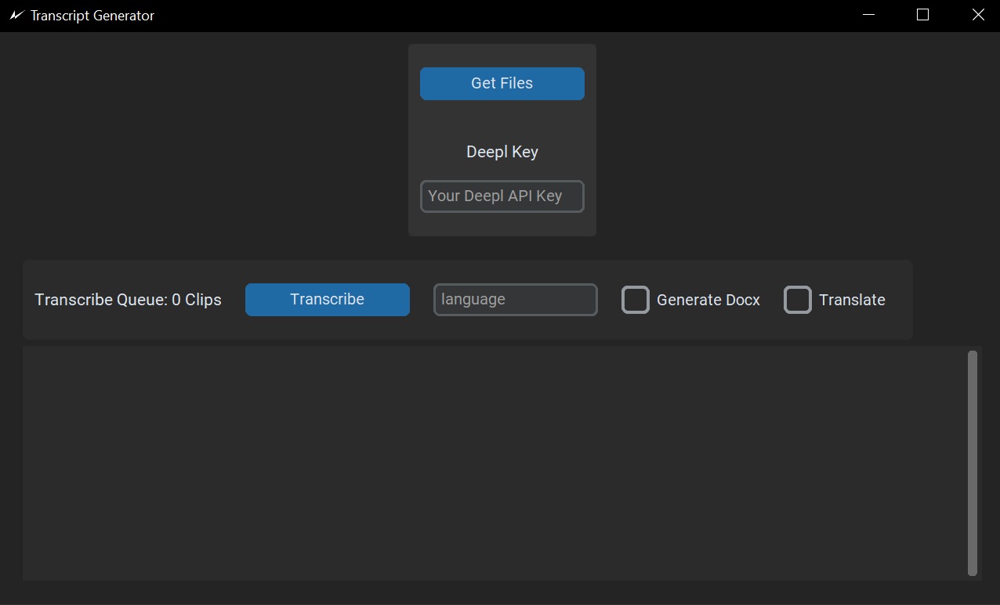

# Transcript Generator

The Transcript Generator is a standalone Python programm which was used in my Bachelor Thesis as a prototype to improve transcription with [OpenAIs Whisper](https://openai.com/research/whisper). Therefore the following steps are added to the transcription:

#### Normalization

Throughout the research we discovered that audio and video files with a strong difference in audio levels between speakers lead to a worse performance in speaker diarization and transcription. Therefore a normalization is performed on the file with [FFmpeg](https://ffmpeg.org/).

#### Speaker Diarization

The speaker diarization is performed with a pretrained open source model, called pyannote speaker diarization. The Implementation uses version 2.1.

https://huggingface.co/pyannote/speaker-diarization

#### Transcription

Ahead of the transcription the spoken language of every individual speaker is analyzed. Then a transcription with [OpenAIs Whisper](https://openai.com/research/whisper) is performed.

#### Translation

The Transcript Generator can translate the transcribed segments in a target language, using the API of [DeepL](https://www.deepl.com/de/pro-api). This will require a DeepL API key.

#### Generation of SRT and DOCX files

The Transcript Generator generates a SRT File and optionally a DOCX File after the transcription is done. The following Image shows an example of a generated DOCX file:

## Installation

### Download and install _Python for Windows_ (>3.9.5).

Normally, when opening a Command Shell in Windows and typing

> python

it should kick in and install Python via the Windows App Store.

Manually: https://www.python.org/downloads/

### Download and install _Git for Windows_

> winget install --id Git.Git -e --source winget

### Clone the repository via git into a folder

### Run the install.bat file

This will install the required dependencies.

### Initial use

When running the Transcript Generator for the first time you need to launch it with admin privileges to download the pretrained model from huggingface for the speaker diarization.

### UI

After adding files to the queue you can select whether you want to generate a DOCX file as well or just a SRT File.
To use the translation feature you will need to enter a Deepl API key.
